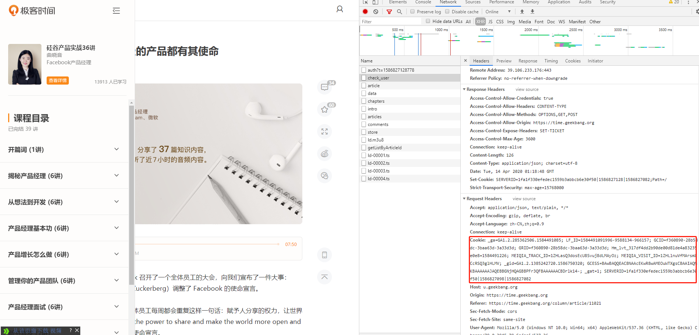

# 极客时间专栏转换为PDF

>说明：该项目仅仅只能用户个人学习使用，不能在商业中使用，若极客时间官方要求该代码仓库删除，请联系我进行删除
>说明：该项目原项目为[jjeejj的geektime2pdf](https://github.com/jjeejj/geektime2pdf)，此处对项目做了文件名的兼容，并修改了部分readme文档（使用了我的仓库，
>新增了cookie的取值

## 使用方法

### 配置信息

在配置文件[config.js](./config,js)中修改配置所需要的信息

```js
/**
 * 需要转换为 pdf 的配置信息 
 */
module.exports = {
    url: 'https://time.geekbang.org/serv/v1/article', // 该配置项不需要改动
    commentUrl: 'https://time.geekbang.org/serv/v1/comments', // 该配置项不需要改动
    columnBaseUrl: 'https://time.geekbang.org/column/article/', // 该配置项不需要改动
    columnName: '玩转VScode', // 专栏名称
    firstArticalId: 18053, //专栏第一篇文章的ID
    isdownloadVideo: false, // 是否下载音频
    isComment: false, // 是否导出评论
    cookie: 'cookie'
};
```

* 上面的配置项**前三项是不需要修改**的, 只需要修改后面的专栏信息

* 会自动生成一个`geektime_{{columnName}}` 的文件夹来保存导出的所有`pdf`文件, `columnName` 为上面配置的

* `firstArticalId` 这个参数最好配置专栏第一篇文章的 `ID` ，这个可以获取专栏的所有的文章,若不是第一篇文章的`ID` 则获取的是该文章以及之后的文章

* `cookie` 你在网页版登录后返回的`cookie`信息，找一个请求（请求头`Request Headers`中含`Cookie`）的，就是`Cookie`中的字符串，如下图红框



### 运行

1. `git clone git@github.com:moneyer/geektime2pdf.git` 在本地克隆下来
2. 然后执行 `npm i` 安装依赖
3. 运行主程序 `node columnArticleList.js` 等待一段时间,生成 `PDF` 完成


## 导出结果


